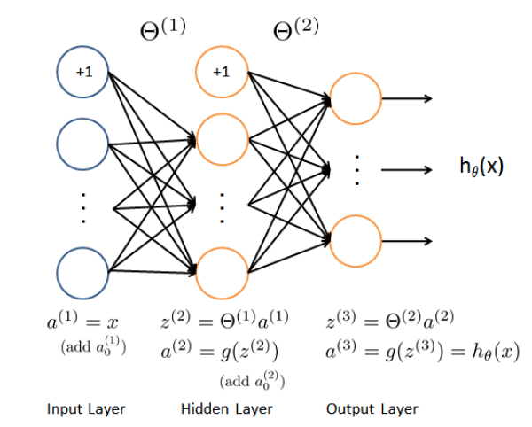
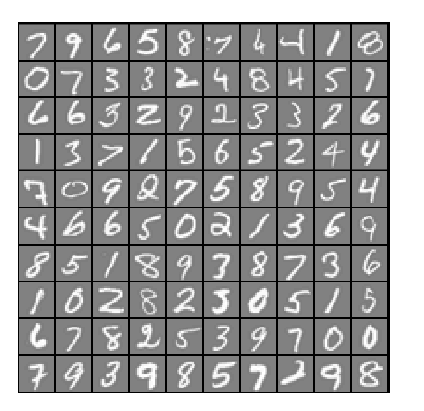
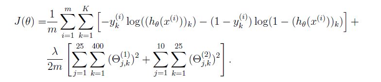

# Neural networks learning
<h2> Hand written digit recognition </h2>

We have 3 layers in this neural network.  

1st layer - input layer (400 * 1)  
2nd layer - hidden layer (25 hidden units)  
3rd layer - Output labels (Total 10) (0, 1, 2, 3, 4, 5, 6, 7, 8, 9) 0 is used for 10 for simplicity.  

   

Training data: 
data1.mat:   
X = 5000 * 200 matrix. 
200 columns corresponds to 20 * 20 matrix (which are 400 floating point numbers, for each pixel) 
            
output: y = 5000 rows vector containing output values from 0-9. This output is corresponding to each row from input.             
We already have tarined parameters in, weights.mat,  
Theta1 (Dimension 25 * 401) 
Theta2 (Dimention 10 * 26) 
         
 

STEPS INVOLVED IN THIS PROJECT: 

1. nnCostFunction.m -- using Feedforward to calculate cost function. First without regularization, then with regularization. 
    
2. Backpropagation implementation with below steps:    
   (i) Sigmoid of a function -- 1/(1+pow(e,-z)) , where z is the given input. 
   (ii) Randomly initializing parameter Theta in the range [-0.12 0.12]     
3. Backpropagation steps: 
   -- We will do a forward pass to compute activations (a) for every layer including Output layer.  
   
   
   
   
   
   
   
   
   
   
   

